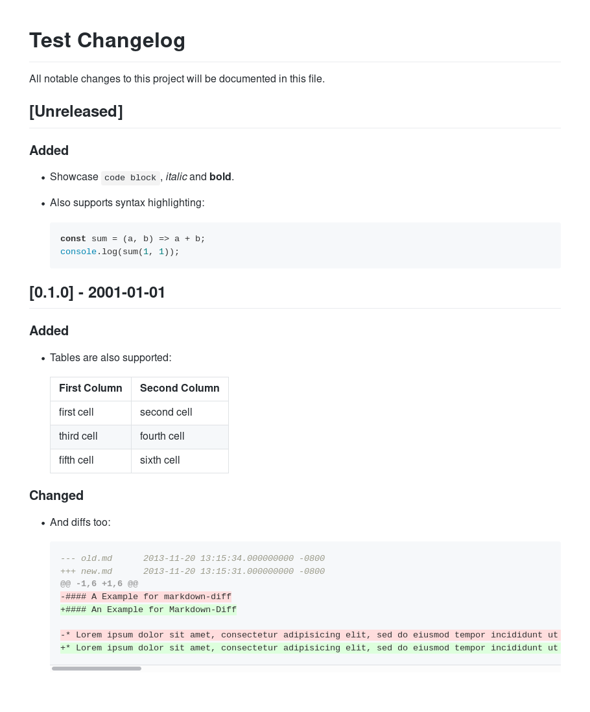

[](https://npmjs.org/package/changelog-to-html)
[](https://circleci.com/gh/activeviam/changelog-to-html)

# Goal

This package provides a CLI to convert a `CHANGELOG.md` file following the [Keep a Changelog](http://keepachangelog.com/en/1.0.0) convention to a static web page with permalinks and a GitHub look and feel.

It will mostly be useful for closed source libraries where customers do not have access to the source code and thus cannot benefit from the Markdown viewer built into GitHub.

## Screenshot

The generated HTML page looks like this:



## Permalinks

This package generates permanent links for each section.

Let's take a changelog example:

```markdown
## [0.3.0] - 2003-03-03

### Added

* A bullet.

## [0.2.0] - 2002-02-02

### Added

* Another bullet.

## [0.1.0] - 2001-01-01

### Added

* Last bullet.
```

GitHub will generates these URLs:

* 030---2003-03-03
  * added
* 020---2002-02-02
  * added-1
* 010---2001-01-01
  * added-2

This makes the `added` anchors ephemeral.
Indeed, when you release another version of your package, all the existing anchors will change because GitHub will increment their trailing number:

* 040---2004-04-04
  * added
* 030---2003-03-03
  * added-1 (used to be _added_)
* 020---2002-02-02
  * added-2 (used to be _added-1_)
* 010---2001-01-01
  * added-3 (used to be _added-2_)

On the other hand, this package will generate these anchors:

* 0.3.0
  * 0.3.0-added
* 0.2.0
  * 0.2.0-added
* 0.1.0
  * 0.1.0-added

By prefixing the _type of changes_ section anchor with the release name, we guarantee that the link will be permanent.

# Usage

1. Add this package to your dependencies: `npm install --save-dev changelog-to-html`
2. Add `"changelog-to-html": "changelog-to-html"` to your `package.json` `scripts`.

You can get the command help by running `npm run changelog-to-html -- --help`.
